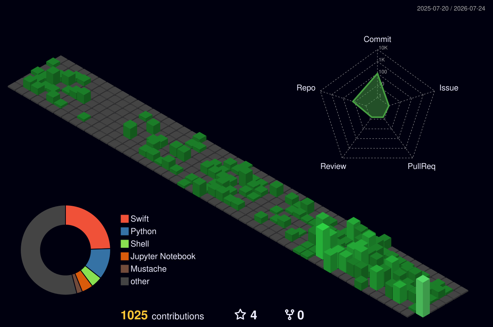

# ⚡ Hi, I'm Richard (`Richard-yq`) 👋
### 📡 5G NR / Open-RAN & Protocol System Engineer

<!-- Dynamic Typing Header -->

  
  
  

---

## 🛠️ Tech Stack & Domain Expertise

<table>
  <tr>
    <td width="33%" valign="top">
      <h3 align="center">📡 5G & Protocol</h3>
      

         
         
         
         
         
        
      

    </td>
    <td width="33%" valign="top">
      <h3 align="center">💻 Languages & Core</h3>
      

         
         
         
         
         
        
      

    </td>
    <td width="33%" valign="top">
      <h3 align="center">🐳 Cloud & Analysis</h3>
      

         
         
         
        
      

    </td>
  </tr>
</table>

---

## 👷‍♂️ 🧱 工程師敲磚頭特區 (Code Building in Progress)

<!-- 動態像素工程師敲磚頭動圖特效 -->

  

<blockquote>
  <b>🔨 "Code is built one brick at a time — 一磚一瓦敲出高穩定度的 5G 通訊系統！"</b>
</blockquote>

 

<!-- 連續 Commit 紀錄卡片 (暗色炫彩風格) -->

---

## 🧱 3D 磚塊城市 & 🐍 貪食蛇 Contribution 特效

### 🏢 3D Contribution Grid (立體磚塊城市)

  

### 🐍 Snake 吃綠磚動態圖

---

## 📊 GitHub Analytics (數據統計)

---

  ⚡ Designed & Built with 💡 by <b>Richard</b> | Powered by 5G NR & C++ Systems

